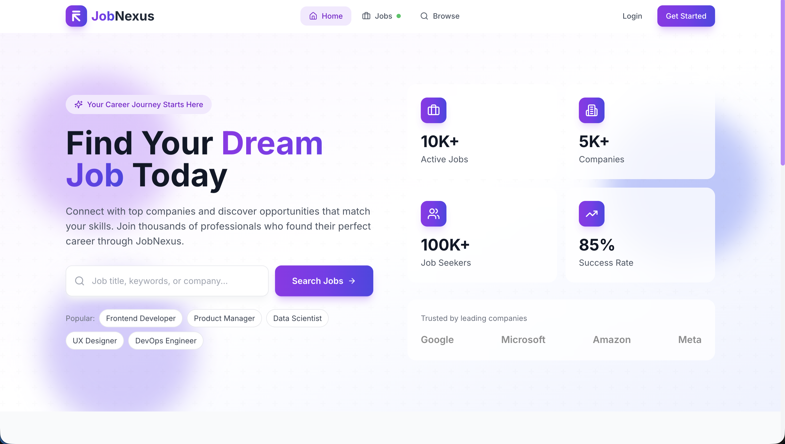
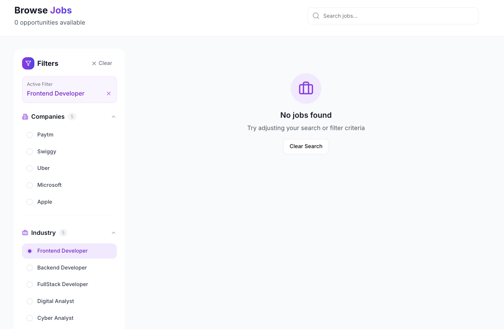
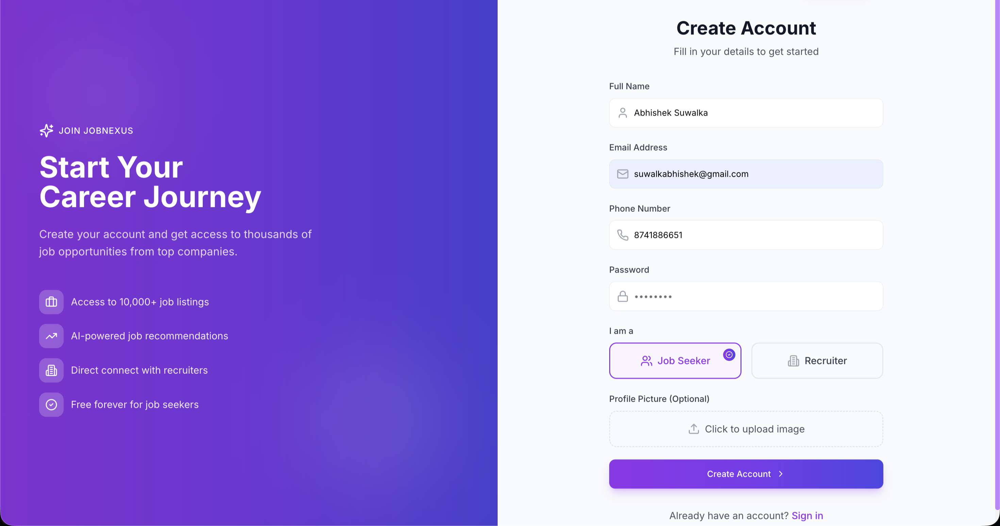

<p align="center">
  <h1 align="center">JobNexus</h1>
</p>

<p align="center">
  A modern job portal with glassmorphism UI, gradient animations, and a premium user experience.
</p>

<p align="center">
  <a href="https://job-nexus-two.vercel.app">🌐 Live Demo</a> •
  <a href="#screenshots">📸 Screenshots</a> •
  <a href="#features">✨ Features</a> •
  <a href="#tech-stack">🛠 Tech Stack</a>
</p>

<p align="center">
  
</p>

---

## ✨ Features

| Feature | Description |
|---------|-------------|
| 🎨 **Premium UI** | Glassmorphism cards, gradient backgrounds, smooth animations |
| 📱 **Fully Responsive** | Mobile-first design with hamburger menu and touch-friendly |
| 🔐 **Split-Screen Auth** | Modern login/signup with illustrations and password strength meter |
| 🔍 **Advanced Search** | Filter jobs by company, industry, salary with collapsible sidebar |
| 💼 **Job Management** | Browse, view details, and apply to jobs with one click |
| 👤 **User Profiles** | Gradient banner, skill badges, resume upload |
| 🏢 **Company Profiles** | Recruiters can create companies and post jobs |
| 📊 **Admin Dashboard** | Analytics, user management, data visualization |

---

## 🛠 Tech Stack

### Core


### UI & Animation


### Data & Backend Integration


---

## 📸 Screenshots

### Homepage
Animated gradient blobs, glassmorphism stat cards, and a prominent search bar.


### Jobs Listing
Browse all jobs with a collapsible filter sidebar. Each card shows company, salary, location, and job type.



### Authentication
Split-screen design with gradient illustration. Includes role selection and password strength indicator.

<p>
  
  
</p>

---

## 🚀 Getting Started

### Prerequisites
- Node.js 18+
- npm or yarn

### Installation

```bash
# Clone the repository
git clone https://github.com/Abhisheksuwalka/JobNexus.git
cd JobNexus

# Install dependencies
cd frontend
npm install

# Start development server
npm run dev
```

Open [http://localhost:5173](http://localhost:5173) in your browser.

### Build for Production

```bash
npm run build
npm run preview
```

---

## 📁 Project Structure

```
frontend/
├── src/
│   ├── components/
│   │   ├── auth/          # Login, Signup
│   │   ├── common/        # Navbar, Footer
│   │   ├── layout/        # Page sections
│   │   ├── pages/         # Route pages
│   │   └── ui/            # shadcn components
│   ├── hooks/             # Custom React hooks
│   ├── redux/             # Store & slices
│   └── utils/             # Constants, helpers
├── index.html
└── tailwind.config.js
```

---

## 🔌 API Integration

This frontend connects to a REST API backend. To integrate your own backend, update the base URL:

```javascript
// src/utils/constant.js
export const USER_API_END_POINT = "https://your-api.com/api/v1/users";
export const JOB_API_END_POINT = "https://your-api.com/api/v1/job";
export const APPLICATION_API_END_POINT = "https://your-api.com/api/v1/application";
export const COMPANY_API_END_POINT = "https://your-api.com/api/v1/company";
```

### Required Endpoints

| Method | Endpoint | Description |
|--------|----------|-------------|
| `POST` | `/users/register` | Create new user |
| `POST` | `/users/login` | Authenticate user |
| `GET` | `/users/logout` | Logout |
| `GET` | `/job/get` | List all jobs |
| `GET` | `/job/get/:id` | Get job details |
| `GET` | `/application/apply/:id` | Apply to job |
| `POST` | `/company/register` | Create company |

---

## 🎨 Design System

The project uses a custom design system built on Tailwind CSS:

| Token | Value | Usage |
|-------|-------|-------|
| Primary | `#8B5CF6` | Buttons, links, accents |
| Accent | `#4F46E5` | Gradients, hover states |
| Background | `#FFFFFF` | Cards, modals |
| Foreground | `#1F2937` | Text, icons |

Custom utilities available:
- `.gradient-bg` - Purple to indigo gradient
- `.gradient-text` - Gradient text effect
- `.glass` - Glassmorphism effect
- `.card-hover` - Hover lift animation

---

## 👨‍💻 Author

<p>
  <a href="https://linkedin.com/in/abhisheksuwalka">
    
  </a>
  <a href="https://github.com/Abhisheksuwalka">
    
  </a>
</p>

---

<p align="center">
  Built with 💜 using React & Tailwind CSS
</p>
